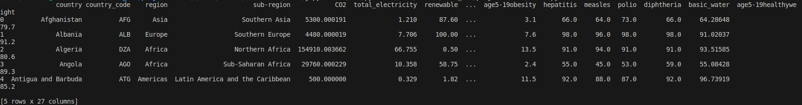

# Dataset and preprocessing

Om onze datastory te creëren, hebben we twee datasets uitgekozen die informatie bevatten over alle landen wereldwijd. Echter zijn deze oorspronkelijke datasets niet direct bruikbaar vanwege ontbrekende informatie of gegevens die voor ons niet relevant zijn. Daarom hebben we de datasets vooraf verwerkt om ze geschikt te maken voor onze datastory.

## Dataset 1
De eerste dataset bevat informatie zoals de bevolkingsgrootte en het bruto binnenlands product (GDP) van elk land ter wereld van 1960 tot 2019. Ook worden de energieopwekking en het percentage duurzame en niet-duurzame bronnen vermeld. Daarnaast wordt ook de CO2-uitstoot per land aangegeven. Deze dataset geeft ons een beeld van de duurzaamheid van landen.  
Bron: [country-by-country-data-collection-since-1960](https://www.kaggle.com/datasets/tirant/country-by-country-data-collection-since-1960).

## Dataset 2
De tweede dataset bevat data die is verzameld van 2000 tot 2016 van elk land ter wereld en richt zich op zaken zoals levensverwachting, sterfte onder volwassenen, sterfte onder baby's en de vaccinatiegraad van verschillende ziekten. Dit geeft ons een gedetailleerd beeld van de gezondheidssituatie in alle landen.  
Bron: [who-national-life-expectancy](https://www.kaggle.com/datasets/mmattson/who-national-life-expectancy).  

## Samengevoegde dataset
Om de data in de datasets consistent te maken is ervoor gekozen om te filteren op het jaar 2016, aangezien dit het meest recente jaar is dat in beide datasets aanwezig is. Vervolgens worden kolommen zonder data verwijderd en worden de overige lege cellen veranderd in een waarde van -1. Deze stappen zijn nodig om deze waarden te kunnen herkennen en filteren tijdens de visualisaties van de data. Bovendien zijn er extra variabelen berekend zoals *CO2_per_capita*, wat de CO2 uitstoot per inwoners is door de CO2 te delen door de populatie. We hebben het vervolgens vermenigvuldigd met 1000 om de CO2 in ton te berekenen. Ook is *GDP_per_capita* berekend door de GDP te delen door de populatie. Daarnaast is de variabele *age5-19healthyweight* gecreëerd door het verschil van 100 - *age5-19thinness* - *age5-19obesity* te berekenen. Dit geeft een beter inzicht in het percentage van de bevolking met een gezond gewicht. Tenslotte wordt de *adult_mortality* variabel gedeeld door 10 om een percentage te verkrijgen. We hebben gekozen om the delen door 10 omdat de *adult_mortality* het aantal doden per 1000 inwoners was en wij vonden het netter om het in percentage weer te geven. Deze vier variabelen zijn aangemaakt omdat deze meer betekenisvol zijn bij het vergelijken van landen. Hierbij is rekening gehouden met ontbrekende waarden, zodat er geen berekeningen plaatsvinden met waarden van -1. Ten slotte worden de datasets samengevoegd met behulp van de inner join methode op de variabel *country_code* (Figuur 1), omdat deze consistent is in beide datasets.

*Figuur 1. De head van de [samengevoegde dataset](merged.csv).* 

[preprocessing bestand](clean.py)

### Omschrijving Variabelen

| Variable             | Variable Type | Measurement Scale |
| -------------------- | ------------- | ----------------- |
| country              | Discrete      | Nominal           |
| country_code         | Discrete      | Nominal           |
| region               | Discrete      | Nominal           |
| sub\-region          | Discrete      | Nominal           |
| CO2                  | Continuous    | Ratio             |
| total_electricity    | Continuous    | Ratio             |
| renewable            | Continuous    | Ratio             |
| no_renewable         | Continuous    | Ratio             |
| GDP                  | Continuous    | Ratio             |
| population           | Continuous    | Ratio             |
| CO2_per_capita       | Continuous    | Ratio             |
| GDP_per_capita       | Continuous    | Ratio             |
| life_expect          | Continuous    | Ratio             |
| life_exp60           | Continuous    | Ratio             |
| adult_mortality      | Continuous    | Ratio             |
| infant_mort          | Continuous    | Ratio             |
| age1-4mort           | Continuous    | Ratio             |
| alcohol              | Continuous    | Ratio             |
| bmi                  | Continuous    | Ratio             |
| age5-19thinness      | Continuous    | Ratio             |
| age5-19obesity       | Continuous    | Ratio             |
| hepatitis            | Continuous    | Ratio             |
| measles              | Continuous    | Ratio             |
| polio                | Continuous    | Ratio             |
| diphtheria           | Continuous    | Ratio             |
| basic_water          | Continuous    | Ratio             |
| age5-19healthyweight | Continuous    | Ratio             |

*Figuur 2. De variabelen van de samengevoegde dataset omschreven.*
